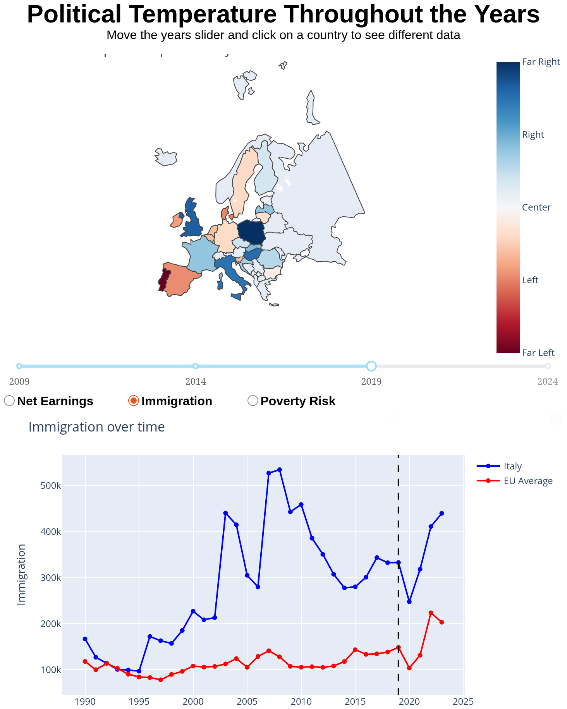

# data15003

Interactive Data Visualization Course, Master in Data Science at University of Helsinki

## Data Visualizer



A video showcase of the visualizer can be found at this [link](https://youtube.com/shorts/L3-hME7Yt54?feature=share).

### Usage

The choropleth map is interactive: click on countries change data visualized in the line chart below. \
The map shows countries' political alignment, based on the european commission election, throughout the years, and data shown can be modified (i.e., the year of the election) via the slider immediately under the map.

The line graph can show three different datasets: 

- Net earnings throughout the years
- Immigration throughout the years
- Poverty risk (percentage) throughout the years

To toggle between them there is a [RadioItems](https://dash.plotly.com/dash-core-components/radioitems) menu that always shows all three options, plus highlighting the selected one. The menu is between the slider and the line chart.

### Goal

Help visualize how political alignment change throughout the years, while also providing data about economy and immigration to help infer some insight about possible correlations.

### Notice

Political temperature has been calculated using DeepSeek, so it must be taken with a grain of salt since it may not be entirely accurate.

## Build

### Requirements

All Python's requirements can be installed by running 

```bash
pip install -r requirements.txt
```

### Run Dash Application

To run the Dash application and see the visualizer, run the script:

```bash
python3 project/graph_maker.py
```

Provided that paths at lines #7, #9, #11, and #13 in `graph_maker.py` get modified, e.g.,

```python
countries_temp_df = pandas.read_csv('/home/mhetac/Documents/GitHub/data15003/project/data/build/countries_temp_all_merged.csv', sep=';')

# change it to
countries_temp_df = pandas.read_csv('YOUR_PATH/project/data/build/countries_temp_all_merged.csv', sep=';')
```