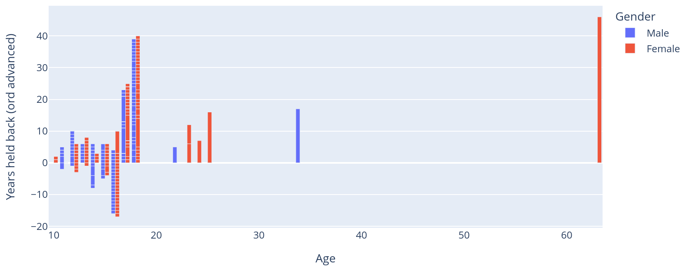
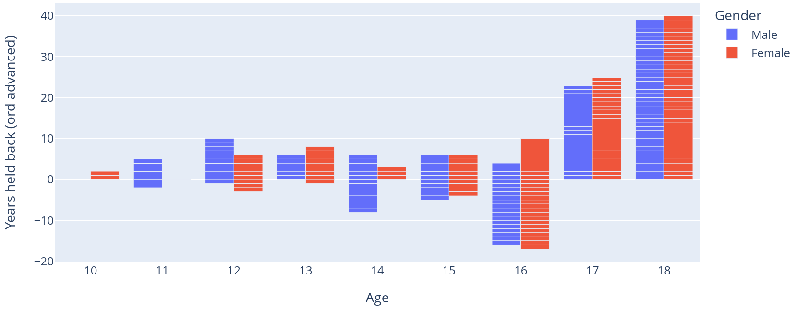
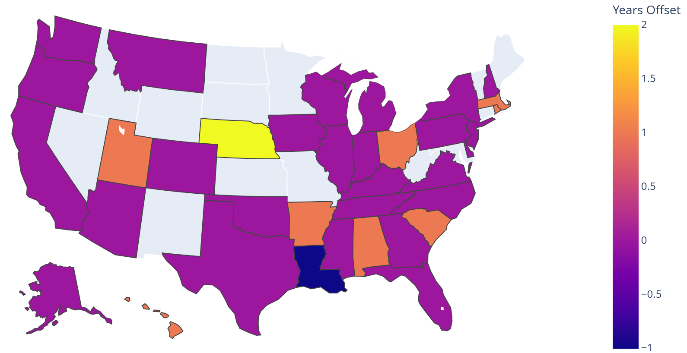

# Second Assignment: Design a Static Visualization

## Tools

Python, with Dash, Plotly Express and Pandas libraries, were used to manipulate the dataset (saved as csv file) and produce the resulting graphs. 

```python
from dash import Dash, html, dcc, dash_table
import plotly.express
import pandas

dataframe = pandas.read_csv('/home/../USA_school_census.csv')
```

The code, datasets and graphs can all be found in the following GitHub repository: [](https://github.com/mhetacc/data15003).

To compile the file yourself to see all the various graphs' iterations, you need the files: 
- https://github.com/mhetacc/data15003/blob/main/ii_second_assignment/USA_school_census.csv
- https://github.com/mhetacc/data15003/blob/main/ii_second_assignment/graphs/grade_retention.py


## Explored Questions: Design Choices and Findings

My approach was, at the start, to look through all the available data, and wonder about what could be inferred by putting some attributes together, for example:
- `Travel_to_School + Travel_time_to_School` + the average car speed in USA: *show how car-centric the USA are, and infer average distance to school*;
- `Sleep_Hours_Schoolnight + Sleep_Hours_Non_Schoolnight + Gender + Ageyears + Importance_owning_computer + Importance_Internet_access`: *see if there are some correlations between gender and sleep hours, or being tech-oriented and sleep hours, and between gender and being tech oriented*;
- `Gender + Ageyears + Superpower`: *bonus for fun*.

The full list of the possible questions (hence possible combinations of attributes) can be found at [this link](https://github.com/mhetacc/data15003/blob/main/ii_second_assignment/questions.md#questions).

### First Question

I settled (initially) with the following combination: `Gender + Ageyears + ClassGrade`, intending to answer the question *"is there some correlation between being held back, or moved forward, one or more years, and gender?*. 

The question was first reduced and re-interpreted as *"what is the offset between the expected grade a student should be in and the grade they are actually in?"*. \
Let's clarify with an example: imagine student Alice is six years old, then they should be in first grade. If they are, say, in second grade then their offset would be equal to `-1`, meaning they got moved forward one year (or they just started school one year earlier). \
Now imagine that student Bob is 20 years old, then they should not even be in high school anymore. But data told us that they are in twelfth grade, meaning their offset is `+3`, hence they were held back three years.

It should be said that this method suffers from a clear problem: we do not know in which month the survey was taken, so we cannot use the attribute `Birth_month` to calculate if the student is to be considered younger or older than what they actually are. \
Let's use an example to explain this point: I was born in October, and school starts in September, hence if I had participated in the survey in September my offset would have been `-1`, while if I did it from December onward it would have been `0`. 

Now we can add back gender into the equation, expanding the question to: *"what is the offset between the expected grade a student should be in and the grade they are actually in, relative to their gender and age?"*.\
I decided to include a projection not only over gender but also over age for two reasons: first, to make it more readable and second to see if there is some difference relative to the grade students are in (since, at least in my experience, that is the case). We will see in the §Design Iterations section how this point could have produced some misleading visualizations. 

It is pretty clear that we want to show a median of the offset over age and gender, not a sum of all the various offsets, and for this reason I choose a graph type that is especially made to show "variation in samples of a statistical population" (source [Wikipedia: Box Plot](https://en.wikipedia.org/wiki/Box_plot)) through data quartiles. Let's briefly explain them (once again, source is [Wikipedia: Quartile](https://en.wikipedia.org/wiki/Quartile))

- Minimum: quartile, minimum value of the data sample;
- Maximum: quartile, maximum value of the data sample;
- First quartile: lowest 25% values of the data sample;
- Second quartile: median of the data sample;
- Third quartile: highest 25% of the data sample.

This gives us a nice and easy to read visualization of a wide set of data points. Lets see the resulting graph:


From the graph we can infer the following conclusions:

1. There is a negligible difference in offset between males and females;
2. There is a negligible difference in offset between different students' ages;
3. The majority of students have an offset between -1 and 1 years;
4. There are some students, especially at ages 17 and 18, that are extremely out of the median, having repeated more than five years (although the reasons may vary).

While points #1 and #2 are self explanatory, I would like to comment briefly over point #3 and #4: having an offset between [-1, +1] means, if we consider my comment about not knowing the month when the survey is taken, that most people are probably in their correct grade. \
Regarding point number four, it should be said that having some isolated cases extremely out of median should not be taken as an indicator that at those ages it is more common to have an offset, since the reasons could vary wildly (e.g., refuge, family situations, human error, etc).

Regarding ink to data ratio, i decided to keep the legend since putting the data inside the graph would have resulted, in my opinion, in less clarity.

### Second Question

At this point, I tough it would be interesting to show a choropleth map of the USA, leveraging the attribute `Region`, to see the median offset difference between the different states (the graph type choice was obvious in this case). \
This time around I did not bother to map the data over gender, since the previous graph already showed how little difference there is between males and females on this matter.

The graph follows, where:

- Range of offset vary between `[-1, +2]`
- Grey-colored states means there is no data available


This shows us how uncommon it actually is to be "out of grade" (i.e., being held back or moved forward) in the USA: most states have a median around zero, nine have a median between `[-1, 1]` (which could, once again, be invalidated by the month when the surveys were taken), and only one state has a median offset of `+2` (meaning people there are, as far as our data is concerned, commonly held back at least one year).\
The colors (and thus the legend) have been made discrete to aid readability.

Once again, regarding data to ink ratio I preferred to keep the legend since some states are too small to write the offset directly inside of them. Maybe it would be possible with some extra steps (like with connecting lines) but I decided to keep it simple.

## Development Process and Design Iterations 

### First Question

Answering such question needed more data then what was available, namely calculating if, compared to their age, some students are in a grade that is higher or lower than expected. \
The *expected grade* is not present in the data, but can easily be calculated by adding one column to our dataset with the formula `Ageyears + 5`, since the rationale is that first grade starts at six.

```python
dataframe['expected_age'] = dataframe['ClassGrade'] + 5
```

Then I calculated the offset of years between their age and the expected one, meaning how many years a student was held back or moved forward compared to the grade they should be in. This was added to, once again, a new column in the data set.

```python
dataframe['age_offset'] = dataframe['Ageyears'] - dataframe['expected_age']
```

At this point our data table looks like this:

| Age | Expected Age | Gender | Offset | ... |
| :-: | :-: | :-: | :-: | :-: | 

And the first thing that came to mind was doing a bar graph to show the offsets, divided by gender, over the age.



The first thing we notice about this graph is that there are some data points (specifically in the x-axis i.e., 'Age') too far away from the others, since there are some students over 20 or even 30 years old.\ This prevent a clear reading of the data chart and we don't know why we have these data points, and the reasons could vary wildly from complicated personal situations to simple human error, so I decided to filter them out, using a simple query:

```python
bargraph_purged = plotly.express.bar(
    df_transformed.query('Ageyears <= 20'),
```

Thus getting the graph that follows:



From this graph it would seem that the amount of students "out of grade" increases over the years, which would seem reasonable to me since I have a bias that come from personal experience: back in my home country this is definitely the case. \
However, we already seen in the final graph (seen in the section §2.1) that this is not true, meaning that the reason is something else entirely: we just have more data points for the later years (i.e., 16, 17 and 18).

### Second Question

As I stated already in section §2.2, I decided to not consider gender this time around since there is no noticeable difference between the two (in the matter of grade retention).

I needed to modify a little bit the data in order to group the median offsets by the state code, and then make sure that there are no repetitions, like so:

```python
df_regions = dataframe[['age_offset', 'Region']]
median_per_region = df_regions.groupby("Region")["age_offset"].median().reset_index()

# make it unique on 'Region' attribute
df_median = df_regions.merge(median_per_region, on=["Region", "age_offset"]).drop_duplicates(subset=['Region'])
```

At this point I was able to compute the choropleth map, which follows:



As we can see, continuos colors in the legend, while having great contrast, make it harder to see immediately where the distinction between the values are, especially because said values are discrete. So I modified both the dataframe and the graph to produce the final one seen in section §2.2, which uses discrete colors.

## Lessons Learned

From a strictly technical standpoint, I learned to set up and use some useful visualization tools in Python.

For the iterations on the first question it was clear to me the importance of "purging" the data from un-important data points that are too out of scope, and that if what we want to show is a variation over time we should use graph that are made for that specific purpose, instead than trying to compute it beforehand and try to fit it in a graph that was made for a different purpose.

From the iterations on the second question I learned the importance of distinguishing between discrete and continuous data and visualizations.